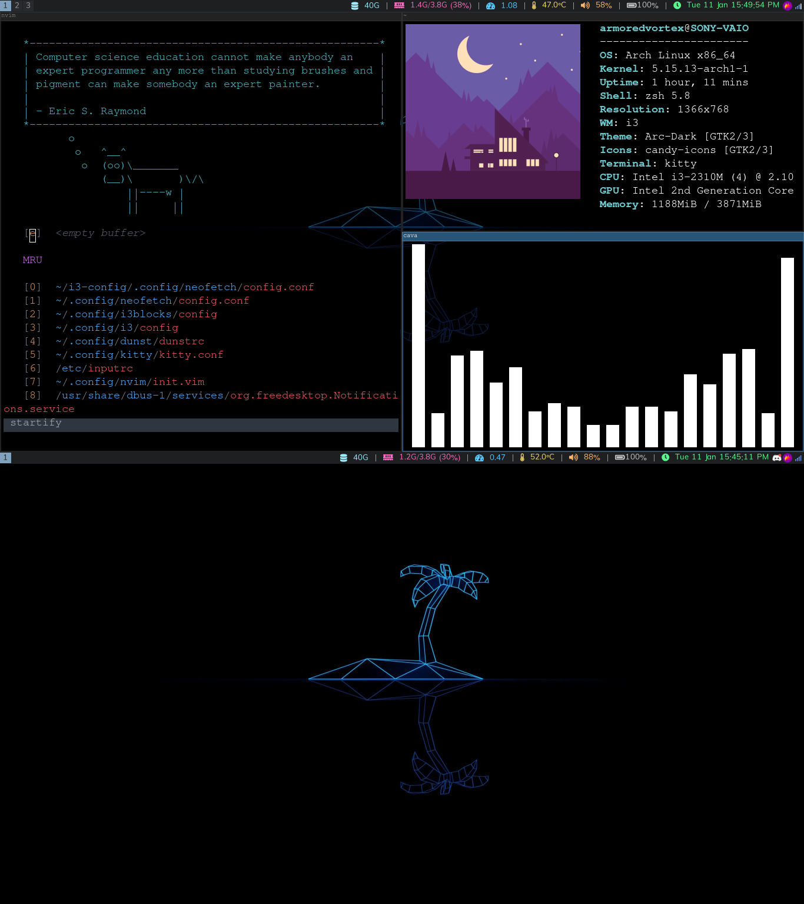

# i3-config
Dotfiles for my i3 setup
 

Details about the setup:

+ **WM**: [i3](https://i3wm.org/)
+ **OS**: [Arch Linux](https://archlinux.org)
+ **Shell**: [zsh](https://wiki.archlinux.org/index.php/Zsh)
+ **Terminal**: [kitty](https://github.com/kovidgoyal/kitty/)
+ **Editor**: [Neovim](https://github.com/neovim/neovim/)
+ **File Manager**: [Thunar](https://git.xfce.org/xfce/thunar/)
+ **Launcher**: [dmenu](https://tools.suckless.org/dmenu/)
+ **Browser**: [Firefox](https://www.mozilla.org/en-US/firefox/browsers)
+ **Display Manager**: [ly](https://github.com/nullgemm/ly)
+ **Compositor**: picom (fork of [ibhagwan](https://github.com/ibhagwan/picom) or [jonaburg](https://github.com/jonaburg/picom))
+ **Workspace Icons**: [Font Awesome](https://fontawesome.com)
+ **Screenshot**: [flameshot](https://flameshot.org/)
+ **Sound Server**: [pipewire](https://pipewire.org/)
